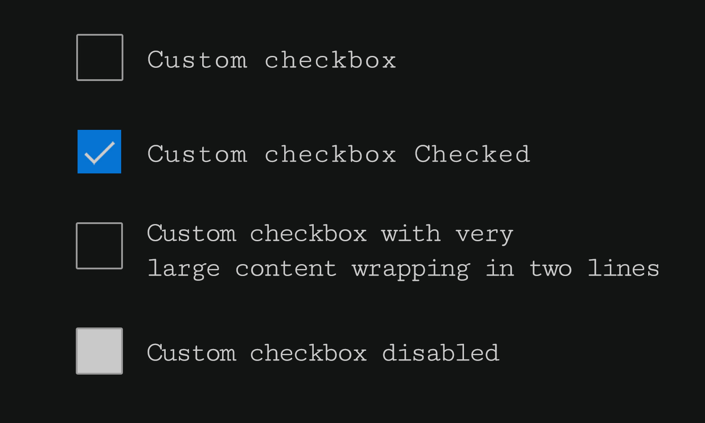

Now a days custom checkbox styles are part of every design, while it's an enhancement over native element it possess challenge if implementation goes wrong. Not only keyboard users, screen readers and even mouse users will face problem while filling up forms.

## Key Consideration

Developing custom checkbox and make it easy to use, do consider these points:

* Must be accessible
* Perfectly aligned to label
* Preventing text selection
* Focus styles
* Labels are associated with inputs

Let's look at sample design consist of various custom checkboxes, this is pretty much we are gonna build and implementing above points.



## Checkbox HTML

Basic markup of single checkbox is pretty much straight forward, `input[type="checkbox"]` followed by `label`, and input id is associated with label for attribute using same value. This is all we need in terms of markup.

### HTML code snippet

```HTML:title=Single-checkbox
  <div class="checkbox-row">
    <input type="checkbox" name="checkbox_default" id="checkbox_one" class="checkbox" />
    <label for="checkbox_one">Checkbox Default</label>
  </div>
```

### CSS code snippet

```CSS:title=Custom checkbox CSS
  .checkbox {
    position: absolute;
    left: -99999px;
    right: auto;
  }

  label {
    display: flex;
    align-items: center;
    cursor: pointer;
    padding-left: 46px;
    position: relative;
    min-height: 32px;
    display: inline-flex;
    align-items: center;
    user-select: none;
  }
  .checkbox + label::before {
    border: 2px solid #000;
    content: "";
    height: 28px;
    position: absolute;
    left: 0;
    top: 0;
    width: 28px;
  }
  .checkbox:checked + label::before {
    background: #0f70d2;
    border-color: #0f70d2;
  }

  .checkbox:checked + label::after {
    content: "";
    width: 6px;
    height: 14px;
    position: absolute;
    top: 6px;
    left: 13px;
    border: 2px solid;
    border-left: 0;
    border-top: 0;
    opacity: 0;
    transform: rotate(45deg);
    transition: opacity 0.2s ease-in-out;
    color: #fff;
  }

  .checkbox:checked + label::after {
    opacity: 1;
  }
```

While it solves complex layout design and opens new path for implementing any sort of design layouts across devices (laptop, large desktop, tablet, phone, phablet etc...). But at the same time incorrect implementation leads to accessibility issues for keyboard users and screen readers. Let's dive straight into it.

## Visual vs. Logical Reordering

While CSS Grid enables reordering of content in various ways, but it should only be used for visual, not logical reordering of content. Here is an example of simple grid consist of 2 rows and 3 columns, both have common markup but different output based on styling:

* First one is correct order of grid
* While second is tweaked with grid-row property

> These columns have link, so visually user will see **4th link in 1st row**, but screen readers and keyboard user will encounter problem, as tabbing will jump to **3rd link in 2nd row** then back to **4th link on 1st row**.

### Solution

Well solution is simple and elegant, just move 4th link in markup after 2nd and it will not be an issue any more. Below you can see code in action as well:

### Codesandbox

https://codesandbox.io/s/css-grid-ck85m?codemirror=1

## Flat markup vs. Semantic markup

Well CSS Grid solves lot of problems, but one should be extra careful while writing markup. To create a grid all items should be direct child of container, any items which are not direct child will not inherit `display: grid` property.

So what happens next is, when some developer wants to create grid structure there may need arise to flatten out markup for whatever reason but it will break semantic meaning of layout and leads to accessibility issues. Let's take a classic example of **header** layout consist of **logo and navigation** links.

Below are the sample code snippets of flatten markup and semantic markup

### Code Snippets

``` HTML:title=Flatten-Markup
  <header class="grid-container">
    <a href="#" class="logo">
      
    </a>
    <a href="#" class="nav-link">Home</a>
    <a href="#" class="nav-link">About</a>
    <a href="#" class="nav-link">Services</a>
    <a href="#" class="nav-link">Contact</a>
  </header>
```

### Lost semantic

Here comes the real issue with flatten markup and it will cause huge inconvenience to screen reader users, as there is no to communicate presence of navigation in it. It will announce flat links in header.

### The correct approach

Using right semantic structure, we can achieve desired output as well as make things easier for screen reader users. Below markup in snippet is slightly different from above with right native HTML tags. Now screen reader will announce navigation with multiple list items of links.


``` HTML:title=Semantic-Markup
  <header class="grid-container grid-container-semantic
  grid-container--three">
    <a href="#" class="logo">
      
    </a>
    <nav class="top-nav top-nav--semantic">
      <ul>
        <li><a href="#" class="nav-link">Home</a></li>
        <li><a href="#" class="nav-link">About</a></li>
        <li><a href="#" class="nav-link">Services</a></li>
        <li><a href="#" class="nav-link">Contact</a></li>
      </ul>
    </nav>
  </header>
```

You can see how both markup are slightly different, but desired output can be achieved using CSS Grid. See it in action:

### Codesandbox

https://codesandbox.io/s/css-grid-faltten-19s7d

> So, note to self always use semantic markup over flatten markup, though later one saves your time or say it will double your work, once you think of accessibility and decides to re-write it.
